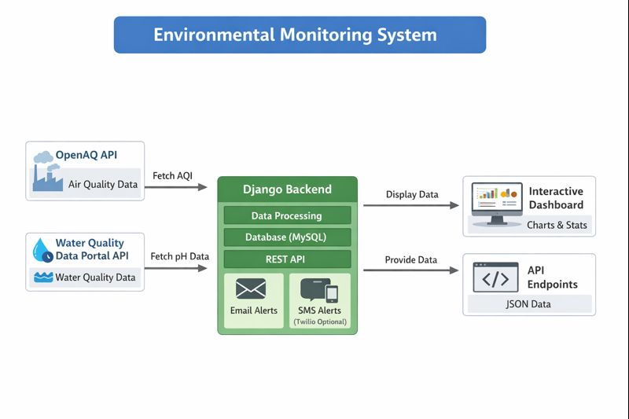

# Environmental-Monitoring-System

A full-stack Django web application to monitor air and water quality in real-time. This system integrates external APIs to fetch live data, visualize historical trends via interactive dashboards, and send automated alert notifications when environmental parameters exceed safe thresholds.  

## Features

- **Real-time Monitoring:** Fetch live air and water quality data using the [OpenAQ API](https://openaqstatus.org/?monitor=service).  
- **Interactive Dashboards:** Visualize historical trends with Chart.js.  
- **Automated Alerts:** Receive SMS notifications for unsafe environmental conditions via Twilio.  
- **Full-Stack Implementation:** Django backend with MySQL database and responsive frontend.  
- **REST API Integration:** Easily extendable with additional environmental APIs.  

## Tech Stack

- **Backend:** Django, Django REST Framework  
- **Database:** MySQL  
- **Frontend:** HTML, Bootstrap, Chart.js  
- **APIs:** OpenAQ  
- **Other Libraries:** requests, twilio  

## Project Structure

## Usage

- **Dashboard:** View real-time air and water quality metrics.
- **Alerts:** Receive SMS notifications if any parameter exceeds safe thresholds.
- **Historical Trends:** Explore trends over time with interactive charts.
  
## Future Enhancements

- Add user authentication for personalized dashboards.
- Integrate additional environmental APIs (noise, soil, etc.).
- Implement push notifications for alerts.

## Author

Mansi Savdekar

[GitHub Profile](https://github.com/mansisavdekar) | [Connect on LinkedIn](https://www.linkedin.com/in/mansi-savdekar-232577181/)

